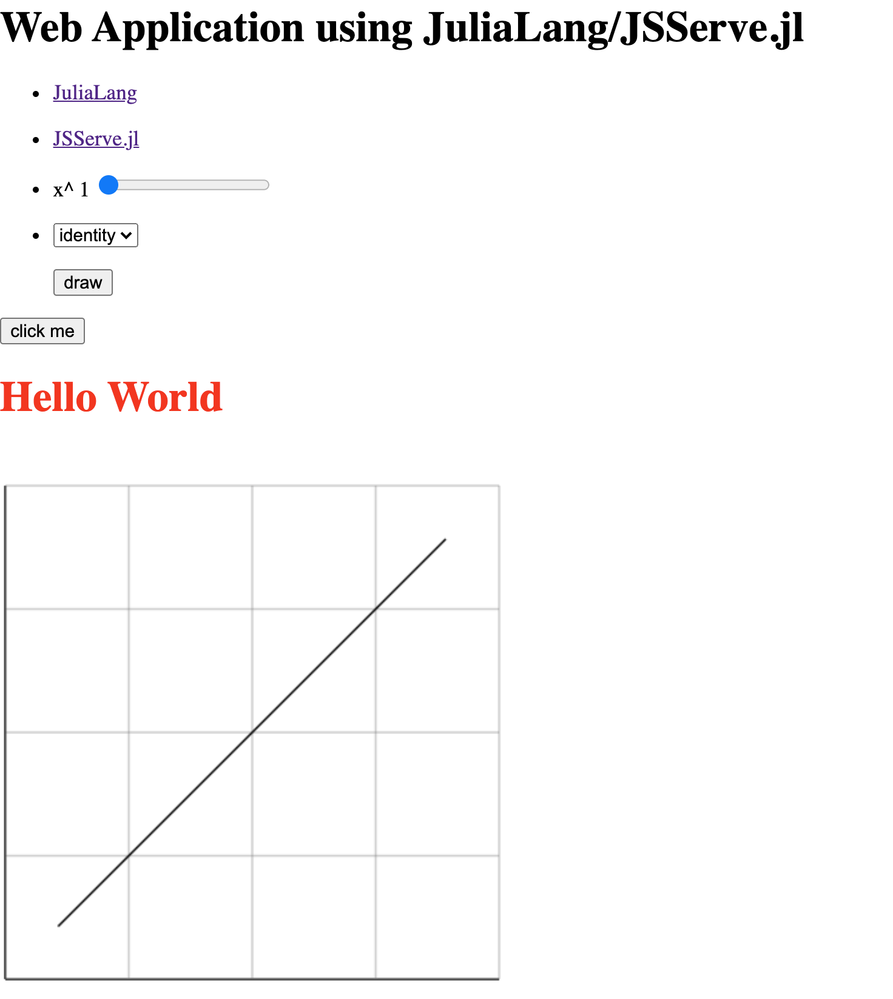

# jldev_meetup

- Function viewer using [JSServe.jl](https://github.com/SimonDanisch/JSServe.jl)

# Usage

- Tested on Julia v1.5.3

```console
$ git clone https://github.com/terasakisatoshi/jldev_meetup.git
$ cd jldev_meetup
$ julia --project=@. -e 'using Pkg; Pkg.instantiate()'
$ julia --project=@. 
               _
   _       _ _(_)_     |  Documentation: https://docs.julialang.org
  (_)     | (_) (_)    |
   _ _   _| |_  __ _   |  Type "?" for help, "]?" for Pkg help.
  | | | | | | |/ _` |  |
  | | |_| | | | (_| |  |  Version 1.5.3 (2020-11-09)
 _/ |\__'_|_|_|\__'_|  |  Official https://julialang.org/ release
|__/                   |

julia> include("app.jl")
```

- It will display like the following result on your Web browser:


